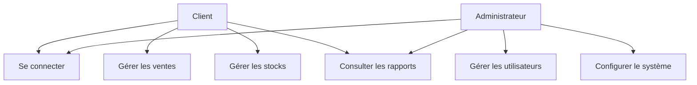
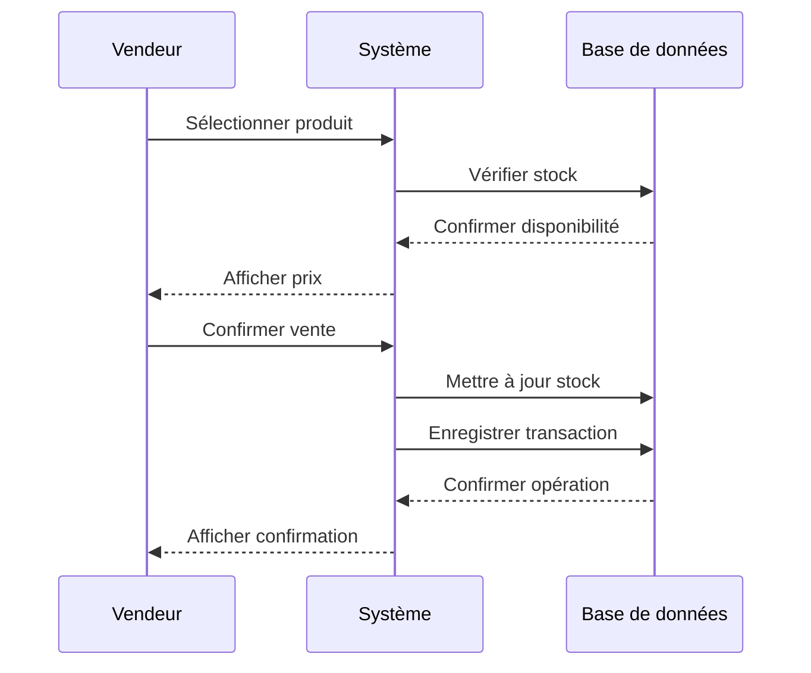
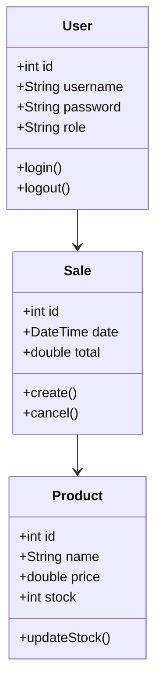

# Annexes

## Annexe A: Captures d'Écran et Maquettes

### Figure 1.2: Maquette de l'écran de connexion
```
+------------------------+
|      LOGO APP          |
|                        |
|  +------------------+  |
|  |    Username      |  |
|  +------------------+  |
|                        |
|  +------------------+  |
|  |    Password      |  |
|  +------------------+  |
|                        |
|  [    SE CONNECTER   ] |
|                        |
+------------------------+
```

### Figure 1.3: Maquette du tableau de bord administrateur
```
+------------------------+
|  Dashboard Admin       |
|                        |
|  [Stats] [Ventes]     |
|  [Users] [Settings]   |
|                        |
|  Résumé des ventes    |
|  +------------------+ |
|  | Graphique        | |
|  +------------------+ |
|                        |
|  Dernières ventes     |
|  +------------------+ |
|  | Liste            | |
|  +------------------+ |
+------------------------+
```

## Annexe B: Diagrammes

### Figure 2.1: Diagramme de cas d'utilisation


### Figure 2.2: Diagramme de séquence - Processus de vente


### Figure 2.3: Diagramme de classe


## Annexe C: Tableaux

### Tableau 1.1: Calendrier prévisionnel du projet
| Phase | Début | Fin | Durée |
|-------|-------|-----|--------|
| Analyse | 01/01/2024 | 15/01/2024 | 2 semaines |
| Conception | 16/01/2024 | 31/01/2024 | 2 semaines |
| Développement | 01/02/2024 | 15/03/2024 | 6 semaines |
| Tests | 16/03/2024 | 25/03/2024 | 1 semaine |
| Déploiement | 26/03/2024 | 31/03/2024 | 1 semaine |

### Tableau 1.2: Matrice des besoins fonctionnels
| ID | Besoin | Priorité | Statut |
|----|---------|-----------|---------|
| BF1 | Authentification | Haute | Réalisé |
| BF2 | Gestion des ventes | Haute | Réalisé |
| BF3 | Gestion des stocks | Haute | Réalisé |
| BF4 | Rapports | Moyenne | Réalisé |

### Tableau 1.3: Matrice des besoins non fonctionnels
| ID | Besoin | Priorité | Statut |
|----|---------|-----------|---------|
| BNF1 | Performance | Haute | Réalisé |
| BNF2 | Sécurité | Haute | Réalisé |
| BNF3 | Maintenabilité | Moyenne | Réalisé |

### Tableau 2.1: Liste des acteurs et leurs rôles
| Acteur | Rôle | Description |
|--------|------|-------------|
| Administrateur | Gestion système | Configuration et maintenance |
| Vendeur | Opérations | Gestion des ventes |
| Client | Utilisateur final | Consultation des rapports |

### Tableau 2.2: Liste des cas d'utilisation
| ID | Cas d'utilisation | Acteur | Description |
|----|-------------------|---------|-------------|
| CU1 | Authentification | Tous | Connexion au système |
| CU2 | Gestion ventes | Vendeur | Création et suivi des ventes |
| CU3 | Gestion stocks | Admin | Suivi et mise à jour des stocks |

### Tableau 3.1: Technologies utilisées
| Catégorie | Technologies |
|-----------|--------------|
| Frontend | Flutter, Dart |
| Backend | Node.js, Express |
| Base de données | MongoDB |
| Outils | Git, VS Code |

### Tableau 3.2: Structure de la base de données
| Collection | Champs |
|------------|---------|
| Users | id, username, password, role |
| Products | id, name, price, stock |
| Sales | id, date, total, items |

## Annexe D: Documentation Technique

### Configuration de l'environnement
```bash
# Installation de Flutter
flutter pub get
flutter pub upgrade

# Configuration de l'environnement de développement
flutter doctor
flutter config --android-studio-dir="C:\Program Files\Android\Android Studio"
```

### Structure des données (JSON)
```json
{
  "user": {
    "id": "string",
    "username": "string",
    "password": "string",
    "role": "string"
  },
  "product": {
    "id": "string",
    "name": "string",
    "price": "number",
    "stock": "number"
  },
  "sale": {
    "id": "string",
    "date": "date",
    "total": "number",
    "items": "array"
  }
}
```

### Tests unitaires
```dart
void main() {
  group('User Model Tests', () {
    test('should create user with valid data', () {
      final user = User(
        id: '1',
        username: 'test',
        password: 'password',
        role: 'admin'
      );
      expect(user.id, '1');
      expect(user.username, 'test');
    });
  });
}
```

## Annexe E: Captures d'Écran Finales

### Figure 3.2: Interface de connexion
[Capture d'écran de l'interface de connexion]

### Figure 3.3: Tableau de bord administrateur
[Capture d'écran du tableau de bord]

### Figure 3.4: Interface vendeur
[Capture d'écran de l'interface vendeur]

### Figure 3.5: Page des rapports
[Capture d'écran des rapports]

---

*Annexes complétées le 31/03/2024* 