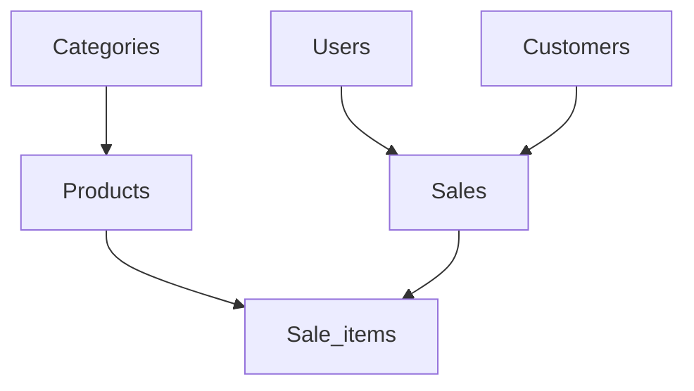

# POS System
## Application de Gestion de Vente

---

# Vue d'Ensemble
## Fonctionnalités Principales

- 🛍️ Système de caisse (POS)
- 📦 Gestion des produits
- 👥 Gestion des clients
- 📊 Rapports et statistiques
- 👨‍💼 Interface administrateur et vendeur

---

# Architecture Technique
## Stack Technologique

- **Frontend**: Flutter/Dart
- **Backend**: PHP/MySQL
- **Base de données**: MySQL
- **API**: RESTful
- **Authentification**: JWT

---

# Structure de la Base de Données
## Tables Principales

---

# Module Administrateur
## Fonctionnalités

- 📊 Tableau de bord avec statistiques
- 👥 Gestion des vendeurs
- 📦 Gestion des produits
- 📈 Rapports détaillés
- ⚙️ Paramètres système

---

# Module Vendeur
## Fonctionnalités

- 💰 Système de caisse rapide
- 🛍️ Sélection de produits
- 📊 Gestion des quantités
- 👥 Association client
- 📜 Historique des ventes

---

# Base de Données MySQL
## Points Forts

- 🏗️ Structure relationnelle optimisée
- ⚡ Requêtes performantes
- 🔄 Gestion des transactions
- 💾 Sauvegarde automatique
- 📈 Indexation efficace

---

# Sécurité
## Mesures Implémentées

- 🔐 Authentification sécurisée
- 👥 Gestion des rôles
- 🛡️ Protection des données
- 📝 Journalisation des actions
- 💾 Sauvegarde automatique

---

# Performance
## Optimisations MySQL

- 📈 Indexation optimale
- ⚡ Requêtes optimisées
- 💾 Mise en cache
- 🔌 Gestion des connexions
- 📊 Monitoring des performances

---

# Avantages
## Bénéfices

- ✅ Réduction des erreurs
- ⏱️ Gain de temps
- 📊 Meilleure gestion
- 🔄 Données en temps réel
- 🎯 Facilité d'utilisation

---

# Perspectives
## Évolutions Futures

- 💳 Paiement en ligne
- 🌐 Application web
- 🤖 IA pour l'analyse
- 🔄 API GraphQL
- ☁️ Déploiement cloud

---

# Démonstration
## Points Clés

1. 💰 Processus de vente
2. 📦 Gestion des stocks
3. 📊 Génération de rapports
4. 👨‍💼 Interface administrateur
5. 👥 Gestion des clients

---

# Conclusion
## Points Forts

- 🎯 Solution complète
- 🎨 Interface intuitive
- ⚡ Performance optimale
- 🔒 Sécurité renforcée
- 📈 Évolutivité garantie

---

# Contact
## Informations

- 🛠️ Support technique
- 📚 Documentation
- 🎓 Formation
- 🔧 Maintenance
- 🔄 Mises à jour
